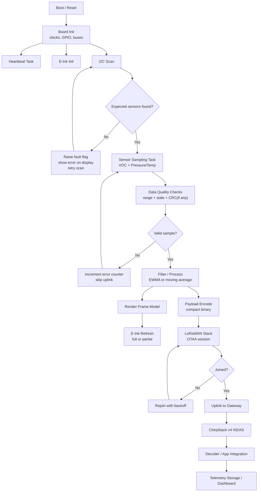
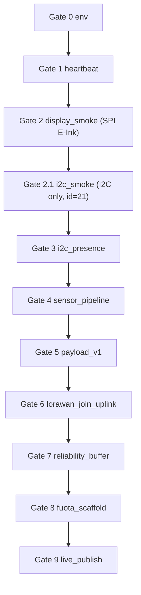
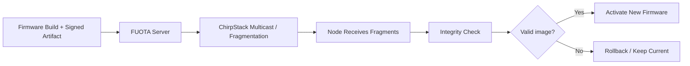

# Data Flow Diagram

## Runtime Data Path

## Gate Control Path (Canonical)

Control policy:
- Run one gate per flash cycle.
- On PASS, firmware logs `result=PASS gate=<id>` and halts progression.
- Operator must change `CONFIG_APP_GATE` and reflash before next gate.

## Control and Timing Notes

- Display refresh is decoupled from sensor sampling; update on data-change threshold and max interval.
- Uplink scheduler should enforce AS923-1 duty-cycle and fair access limits.
- Join/uplink retries must use capped exponential backoff.
- Error counters and last-fault reason should be visible in serial logs and a debug screen.

## FUOTA Control Path (Future)

