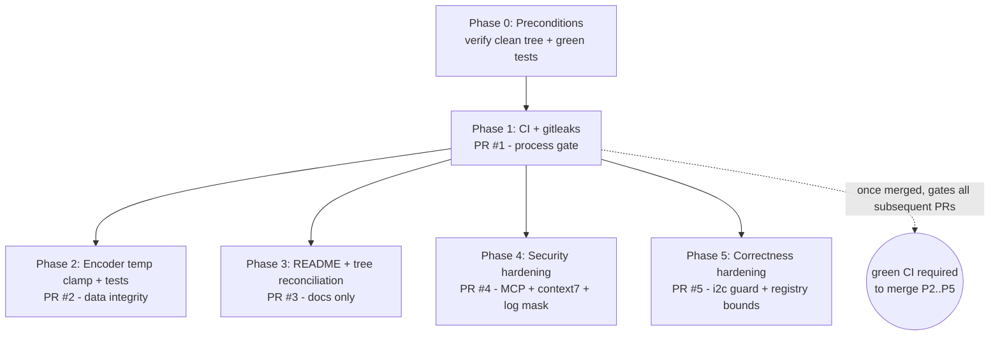

# CLAUDE.md — Remediation Runbook: `rak4630-e-ink-claude` Code-Review Fixes

> **⚠ Historical (pre-P6 / PlatformIO-nRF52).** This doc predates the ESP-IDF/ESP32-S3 consolidation and references the retired `pio/` tree. Canonical instructions now live in [CLAUDE.md](../CLAUDE.md) (ESP-IDF `firmware/` + Kconfig).

> **Role:** Senior firmware/DevOps engineer executing a phase-gated remediation.
> **Execution model:** Claude Code CLI runs each phase in order. Each phase is **one PR**, small and reversible. Do **not** advance past a gate whose smoke test fails. **Never push to remote unless explicitly instructed** — this runbook stops at "commit + open PR locally"; the human merges.
> **Repo:** `rnd-southerniot/rak4630-e-ink-claude`
> **Source of findings:** code review dated 2026-06-20 (CI gap, gitleaks gap, encoder temp overflow, two-tree drift, MCP path-traversal, i2c truncation, AppKey log leak, registry-path validation gap, unpinned MCP).

---

## 0. Operating Rules (read first)

| Rule | Detail |
|---|---|
| Branch per phase | `git checkout -b <branch>` off the latest `main`. One PR per phase. |
| Gate discipline | Every phase ends with a **Smoke Test**. PASS → commit + open PR. FAIL → stop, report, do not proceed. |
| Reversibility | Each phase lists an explicit **Rollback**. No phase depends on an unmerged later phase. |
| No remote push | Stop at `git commit`. Open the PR only with `gh pr create` **if** the human says "push". Otherwise leave the branch local and report the diff. |
| Secrets | Never print a full AppKey, NwkKey, or AppSKey to stdout, logs, or commit messages. DevEUI/JoinEUI are device identifiers (non-secret) and may be shown. |
| Scope | Touch only the files named in each phase. If a phase needs a file not listed, stop and report. |

### Phase dependency graph



Phases 2–5 are mutually independent and may be authored in any order after Phase 1, but Phase 1 should merge first so its CI gate covers the rest.

---

## Phase 0 — Preconditions

**Objective:** Confirm a clean baseline before any change.

**Steps**

```bash
cd "$(git rev-parse --show-toplevel)"
git switch main && git pull --ff-only
git status --porcelain          # must be empty
bash tests/host/run_tests.sh    # must print 3 PASS lines
```

**Smoke Test — Phase 0**

| Check | PASS condition |
|---|---|
| Working tree clean | `git status --porcelain` prints nothing |
| Host tests green | `run_tests.sh` exits 0, prints `PASS payload_encode_v1`, `PASS payload_encode_v2`, `PASS gate_id_legacy_map` |
| Toolchain | `cc --version` succeeds |

FAIL → stop. Do not begin Phase 1 on a dirty or red baseline.

---

## Phase 1 — CI + Secret Scanning (PR #1)

**Why first:** 19 PRs have merged with no automated gate. Once this lands, every later PR is verified on push. The repo handles LoRaWAN AppKeys but has no secret scanner.

**Branch:** `ci/host-tests-and-gitleaks`

**Files created:** `.github/workflows/ci.yml`, `.gitleaks.toml`

> **Design note:** `gitleaks-action@v2` requires a (free) license key for **organization** repos, and `rnd-southerniot` is an org. To avoid that operational dependency, the workflow installs the pinned `gitleaks` **binary** directly. Version pinned to **v8.30.1** (current stable as of 2026-06-20).

### 1.1 — `.github/workflows/ci.yml`

```yaml
name: ci

on:
  push:
    branches: [ main ]
  pull_request:

permissions:
  contents: read

jobs:
  host-tests:
    name: host unit tests (-Werror)
    runs-on: ubuntu-latest
    steps:
      - uses: actions/checkout@v4
      - name: Run host unit tests
        run: bash tests/host/run_tests.sh

  secret-scan:
    name: gitleaks (working tree + full history)
    runs-on: ubuntu-latest
    steps:
      - uses: actions/checkout@v4
        with:
          fetch-depth: 0          # full history so historic commits are scanned
      - name: Install gitleaks (pinned)
        env:
          GITLEAKS_VERSION: "8.30.1"
        run: |
          set -euo pipefail
          url="https://github.com/gitleaks/gitleaks/releases/download/v${GITLEAKS_VERSION}/gitleaks_${GITLEAKS_VERSION}_linux_x64.tar.gz"
          curl -sSfL "$url" -o /tmp/gitleaks.tgz
          sudo tar -xzf /tmp/gitleaks.tgz -C /usr/local/bin gitleaks
          gitleaks version
      - name: Scan
        run: gitleaks detect --source . --config .gitleaks.toml --redact --verbose --exit-code 1
```

### 1.2 — `.gitleaks.toml`

```toml
# Gitleaks config for rak4630-e-ink-claude.
# Extends the upstream default ruleset and adds LoRaWAN-specific rules so an
# AppKey/NwkKey (32 hex) or DevEUI/JoinEUI (16 hex) pasted into source or docs
# is caught before it reaches the remote. Aligns with the org gitleaks pattern.
title = "rak4630-e-ink-claude"

[extend]
useDefault = true

[[rules]]
id = "lorawan-appkey"
description = "LoRaWAN AppKey/NwkKey (32 hex chars) assigned in source or env"
regex = '''(?i)(app_?key|nwk_?key)['"]?\s*[:=]\s*['"]?([0-9a-f]{32})['"]?'''
secretGroup = 2
keywords = ["appkey", "app_key", "nwkkey", "nwk_key"]

[[rules]]
id = "lorawan-eui"
description = "LoRaWAN DevEUI/JoinEUI/AppEUI (16 hex chars) assigned in source or env"
regex = '''(?i)(dev_?eui|join_?eui|app_?eui)['"]?\s*[:=]\s*['"]?([0-9a-f]{16})['"]?'''
secretGroup = 2
keywords = ["deveui", "dev_eui", "joineui", "join_eui", "appeui", "app_eui"]

[allowlist]
description = "All-zero placeholders, examples, and deterministic test vectors are not secrets"
regexes = [
  '''^0{16}$''',     # all-zero DevEUI/JoinEUI placeholder
  '''^0{32}$''',     # all-zero AppKey placeholder
]
paths = [
  '''firmware/\.env\.example''',
  '''tests/host/.*_test\.c''',   # fixed payload byte vectors, not live keys
]
```

### 1.3 — Local verification before commit

```bash
# Install the same pinned gitleaks locally (Linux/macOS arch as appropriate) and dry-run.
gitleaks detect --source . --config .gitleaks.toml --redact --verbose --exit-code 1
bash tests/host/run_tests.sh
# Optional: validate workflow YAML
python3 -c "import yaml,sys; yaml.safe_load(open('.github/workflows/ci.yml')); print('yaml ok')"
```

**Smoke Test — Phase 1**

| Check | PASS condition |
|---|---|
| gitleaks clean on current repo | local `gitleaks detect ...` exits **0** (no findings on the clean tree) |
| Allowlist correct | all-zero placeholder keys in `lorawan_service.cpp` / `.env.example` are **not** flagged |
| Host tests still green | `run_tests.sh` exits 0 |
| YAML parses | `yaml.safe_load` succeeds |

> If gitleaks reports a finding on the **historic** commits, that is a real secret in history — **stop and escalate to the human** (rotation + history rewrite is a separate, deliberate operation, not part of this runbook).

**Rollback:** `git rm .github/workflows/ci.yml .gitleaks.toml && git commit` — pure additions, zero runtime impact.

**Commit / PR**

```
ci: add host-test + gitleaks GitHub Actions gate

- run tests/host/run_tests.sh on push/PR
- pinned gitleaks 8.30.1 binary (org license-free), full-history scan
- .gitleaks.toml: default ruleset + LoRaWAN AppKey/EUI rules, zero-key allowlist
```
PR title: **`ci: gate PRs on host tests + gitleaks secret scan`**

---

## Phase 2 — Encoder Temperature Clamp + Edge-Case Tests (PR #2)

**Why:** `(int16_t)lroundf(temperature_c*100)` has no clamp. A sensor-fault read of **400 °C decodes to −255.36 °C** on the server (sign flip); **660 °C wraps to a plausible 4.64 °C** (silently wrong); **NaN → 0 °C**. The full read-path sets `valid=false` out of range, but the encoder still emits the garbage bytes and the gate-7 buffer accepts on length alone. Fix at the encoder = defense in depth + add the missing test vectors.

**Branch:** `fix/encoder-temp-clamp`

**Files edited:** `pio/src/app_payload.c`, `firmware/main/app_payload.c` (mirror), `tests/host/payload_encode_test.c`

### 2.1 — Add a clamping helper and use it in v1 and v2

In **`pio/src/app_payload.c`** (and the identical block in **`firmware/main/app_payload.c`**), add after the existing `clamp_u16` helper:

```c
/* Encode temperature (centi-degrees) into int16 range. A faulted sensor can
 * produce out-of-range or non-finite values; without clamping the int16 cast
 * silently wraps (e.g. 400.0C -> -255.36C on decode). Clamp to the int16
 * limits and map NaN/Inf to 0 so a bad read can never masquerade as a
 * plausible temperature downstream. */
static int16_t clamp_temp_centi(float temp_c)
{
    if (isnan(temp_c) || isinf(temp_c)) {
        return 0;
    }
    long centi = lroundf(temp_c * 100.0f);
    if (centi < INT16_MIN) {
        return INT16_MIN;
    }
    if (centi > INT16_MAX) {
        return INT16_MAX;
    }
    return (int16_t)centi;
}
```

Then in **both** `app_payload_encode_v1` and `app_payload_encode_v2`, replace:

```c
    const int16_t temp_centi = (int16_t)lroundf(sample->temperature_c * 100.0f);
```

with:

```c
    const int16_t temp_centi = clamp_temp_centi(sample->temperature_c);
```

> `isnan`/`isinf` are in `<math.h>` (already included). `INT16_MIN/MAX` are in `<stdint.h>` (pulled in via `app_payload.h`). No new includes required.
>
> **Two-tree note:** `firmware/main/app_payload.c` is only compiled by the (currently inactive) ESP-IDF tree and is **not** covered by host CI. Patch it identically here so neither tree ships the bug regardless of the Phase 3 decision; if Phase 3 retires the tree, the edit is simply removed with it.

### 2.2 — Add edge-case test vectors to `tests/host/payload_encode_test.c`

Append these tests and call them from `main()`. **Byte values below are verified.**

```c
/* Negative temperature must round-trip: -10.5C -> -1050 -> 0xFB 0xE6. */
static int test_payload_v1_negative_temp(void)
{
    const sensor_sample_t in = {
        .voc_index = 100.0f, .pressure_pa = 100900.0f,
        .temperature_c = -10.5f, .battery_v = 4.0f, .valid = true,
    };
    const uint8_t expected[APP_PAYLOAD_V1_LEN] = {
        0x01, 0x27, 0x10, 0x00, 0x01, 0x8A, 0x24, 0xFB, 0xE6, 0x0F, 0xA0, 0x01,
    };
    uint8_t actual[APP_PAYLOAD_V1_LEN] = {0};
    if (app_payload_encode_v1(&in, actual, sizeof(actual)) != APP_PAYLOAD_V1_LEN) return 1;
    if (memcmp(actual, expected, APP_PAYLOAD_V1_LEN) != 0) return 1;
    return 0;
}

/* Out-of-range temperature must CLAMP, not wrap: 400C -> int16 max -> 0x7F 0xFF
 * (decodes to +327.67C, a sentinel ceiling) instead of sign-flipping. */
static int test_payload_v1_temp_overflow_clamps(void)
{
    const sensor_sample_t in = {
        .voc_index = 100.0f, .pressure_pa = 100900.0f,
        .temperature_c = 400.0f, .battery_v = 4.0f, .valid = false,
    };
    uint8_t a[APP_PAYLOAD_V1_LEN] = {0};
    if (app_payload_encode_v1(&in, a, sizeof(a)) != APP_PAYLOAD_V1_LEN) return 1;
    if (a[7] != 0x7F || a[8] != 0xFF) return 1;   /* clamped, NOT 0x9C 0x40 */
    return 0;
}

/* NaN (faulted read) must encode to 0, never an arbitrary wrapped value. */
static int test_payload_v1_temp_nan_zero(void)
{
    const sensor_sample_t in = {
        .voc_index = 100.0f, .pressure_pa = 100900.0f,
        .temperature_c = NAN, .battery_v = 4.0f, .valid = false,
    };
    uint8_t a[APP_PAYLOAD_V1_LEN] = {0};
    if (app_payload_encode_v1(&in, a, sizeof(a)) != APP_PAYLOAD_V1_LEN) return 1;
    if (a[7] != 0x00 || a[8] != 0x00) return 1;
    return 0;
}

/* Guard contract: NULL out, NULL sample, and undersized buffer all return 0. */
static int test_payload_guards(void)
{
    const sensor_sample_t in = { .valid = true };
    uint8_t a[APP_PAYLOAD_V1_LEN] = {0};
    if (app_payload_encode_v1(NULL, a, sizeof(a)) != 0) return 1;
    if (app_payload_encode_v1(&in, NULL, sizeof(a)) != 0) return 1;
    if (app_payload_encode_v1(&in, a, APP_PAYLOAD_V1_LEN - 1) != 0) return 1;
    return 0;
}
```

Wire them into `main()` alongside the existing two tests, e.g.:

```c
    if ((rc = test_payload_v1_negative_temp()) != 0) return rc;
    printf("PASS payload_encode_v1 negative temp\n");
    if ((rc = test_payload_v1_temp_overflow_clamps()) != 0) return rc;
    printf("PASS payload_encode_v1 temp overflow clamps\n");
    if ((rc = test_payload_v1_temp_nan_zero()) != 0) return rc;
    printf("PASS payload_encode_v1 temp NaN -> 0\n");
    if ((rc = test_payload_guards()) != 0) return rc;
    printf("PASS payload_encode guards\n");
```

Ensure `#include <math.h>` is present in the test file (for `NAN`).

### 2.3 — Verification

```bash
bash tests/host/run_tests.sh
```

**Smoke Test — Phase 2**

| Check | PASS condition |
|---|---|
| All tests green | `run_tests.sh` exits 0 with the 4 new PASS lines plus the original 3 |
| Clamp proven | `test_payload_v1_temp_overflow_clamps` passes (bytes `7F FF`, not `9C 40`) |
| Build strict | compiles under existing `-Wall -Wextra -Werror` (no new warnings) |
| Both trees patched | `grep -c clamp_temp_centi pio/src/app_payload.c firmware/main/app_payload.c` → each ≥ 1 |

**Rollback:** `git revert` the single commit; encoder returns to prior behavior, tests removed.

**Commit / PR**

```
fix(payload): clamp temperature to int16 range; map NaN/Inf to 0

Unclamped (int16)lroundf wraps a faulted reading (400C -> -255.36C on
decode). Clamp to INT16_MIN/MAX and zero non-finite values in both v1/v2
encoders (pio + firmware trees). Add negative/overflow/NaN/guard test
vectors (byte-verified).
```
PR title: **`fix(payload): clamp temperature encoding, add edge-case tests`**

---

## Phase 3 — README + Build-Tree Reconciliation (PR #3, docs only)

**Why:** Root `README.md` "Locked Decisions" says *Platform: ESP-IDF / Core: RAK3312*, but the **active, tested** build is the PlatformIO/Arduino tree (`pio/`), dual-board RAK4630 (nRF52840) + RAK3312 (ESP32-S3); the test harness explicitly calls `firmware/main/` the "legacy" tree. The `v2` payload schema exists only in `pio/`. Drift is already happening. This phase is **documentation only** — zero code/runtime risk — and records reality. It does **not** delete the ESP-IDF tree (that decision is reserved for the human).

**Branch:** `docs/reconcile-build-trees`

**Files edited:** `README.md`, `firmware/README.md`

### 3.1 — Add a "Build Trees" section to root `README.md`

Insert near the top (after the one-line description), and correct the "Locked Decisions" platform line:

```markdown
## Build Trees

This repo currently carries two firmware trees:

| Tree | Path | Toolchain | Status |
|------|------|-----------|--------|
| **Active** | `pio/` | PlatformIO + Arduino (Adafruit nRF52 / Arduino-ESP32) | Built & gate-validated; dual-board RAK4630 (nRF52840) + RAK3312 (ESP32-S3). Payload schema v1 **and v2**. |
| Reference | `firmware/` | ESP-IDF | Historical / not the shipping build. Host tests treat it as legacy. Not covered by CI. |

The host test suite (`tests/host/`) compiles the **`pio/`** sources. New work targets `pio/`.

> **Open decision (owner: R&D lead):** retire `firmware/` (ESP-IDF) entirely, or
> keep it as a maintained second target. Until decided, `firmware/` is reference-only
> and changes there are not CI-gated.
```

In "Locked Decisions", change:

```
- Platform: ESP-IDF
```

to:

```
- Platform: PlatformIO + Arduino (active);  ESP-IDF tree retained as reference (see "Build Trees")
```

### 3.2 — Add a deprecation banner to `firmware/README.md`

Insert as the **first lines** of `firmware/README.md`:

```markdown
> ⚠️ **REFERENCE / LEGACY TREE.** The active, gate-validated build is the
> PlatformIO/Arduino tree under `pio/` (see the root `README.md` → "Build Trees").
> This ESP-IDF tree is retained for reference and is **not** covered by CI.
> Do not add new features here without first reconciling with `pio/`.

```

### 3.3 — Verification

```bash
# Markdown sanity: no broken internal links introduced, files still parse.
grep -n "Build Trees" README.md
grep -n "REFERENCE / LEGACY" firmware/README.md
git diff --stat   # should touch only README.md and firmware/README.md
```

**Smoke Test — Phase 3**

| Check | PASS condition |
|---|---|
| Docs-only diff | `git diff --name-only` lists **only** `README.md`, `firmware/README.md` |
| Banner present | both `grep` commands return a match |
| No code touched | no `.c/.cpp/.h/.py/.sh/.yml` in the diff |
| CI green | Phase-1 workflow passes (docs change → tests + gitleaks still pass) |

**Rollback:** `git revert` — documentation only.

**Commit / PR**

```
docs: reconcile active (pio/Arduino) vs reference (ESP-IDF) build trees

Root README "Locked Decisions" claimed ESP-IDF while the shipping build is
the PlatformIO/Arduino dual-board tree under pio/. Document both trees, mark
firmware/ as reference-only, and flag the retire-vs-keep decision for the lead.
```
PR title: **`docs: reconcile build-tree reality (pio active, firmware reference)`**

---

## Phase 4 — Security Hardening (PR #4)

**Why:** three independent, low-blast-radius security fixes.
1. MCP `get_doc()` path-containment is symlink-unsafe and doesn't reject `..` explicitly.
2. `.mcp.json` pins `@upstash/context7-mcp@latest` with auto-yes (supply-chain drift).
3. `provision-node.sh` prints the **AppKey** to stdout (lands in shell history / CI logs).

**Branch:** `security/mcp-and-provisioning-hardening`

**Files edited:** `mcp/firmware-knowledge/server.py`, `.mcp.json`, `tools/provision-node.sh`

### 4.1 — Harden `get_doc()` against traversal + symlink escape

In `mcp/firmware-knowledge/server.py`, ensure `import os` is present (add if missing), then replace the body of `get_doc`:

```python
@mcp.tool()
def get_doc(path: str) -> str:
    """Return the full markdown of a knowledge doc by its path (from list_docs())."""
    # Reject absolute paths and parent traversal before touching the filesystem.
    if os.path.isabs(path) or ".." in Path(path).parts:
        return "error: invalid path"
    candidate = ROOT / path
    # strict resolve follows symlinks; a symlinked escape resolves outside ROOT
    # and is then rejected by the commonpath containment check below.
    try:
        resolved = candidate.resolve(strict=True)
    except (OSError, RuntimeError):
        return f"error: not found: {path}"
    if os.path.commonpath([str(ROOT), str(resolved)]) != str(ROOT):
        return "error: path outside knowledge root"
    if not resolved.is_file():
        return f"error: not found: {path}"
    return resolved.read_text(errors="replace")
```

> The convenience wrappers (`get_provisioning_guide`, `get_sop_guide`, `get_gate_status`, `get_pin_map`) pass fixed relative paths and continue to work unchanged.

### 4.2 — Pin the context7 MCP version in `.mcp.json`

Resolve and pin the **current** published version (do not invent a number):

```bash
PINNED="$(npm view @upstash/context7-mcp version)"
echo "pinning context7 to $PINNED"
```

Then edit `.mcp.json` so the args use the pinned version (replace `@latest`):

```json
{
  "mcpServers": {
    "context7": {
      "command": "npx",
      "args": ["-y", "@upstash/context7-mcp@<PINNED>"],
      "description": "Library documentation lookup for SX126x-Arduino, Adafruit nRF52, Arduino core, PlatformIO"
    }
  }
}
```

Substitute `<PINNED>` with the exact resolved version string. Keep `-y` (npx non-interactive); only the floating `@latest` tag is the risk being removed.

### 4.3 — Mask the AppKey in `tools/provision-node.sh`

Add a small masking helper near the other helpers (after `die()`):

```bash
mask() { local s="${1:-}"; printf '%s…%s' "${s:0:4}" "${s: -2}"; }
```

Replace the credential banner line:

```bash
echo ">> DevEUI=$DEVEUI  AppKey=$APPKEY  serial=$SERIAL"
```

with:

```bash
# DevEUI/serial are device identifiers (shown in ChirpStack); AppKey is secret -> mask it.
echo ">> DevEUI=$DEVEUI  AppKey=$(mask "$APPKEY")  serial=$SERIAL"
```

The final `>> DONE. DevEUI=$DEVEUI` line already prints only the DevEUI — leave it. The full AppKey still reaches the gitignored `firmware/.env.<board>` (written under `umask 077`), which is the intended sink.

### 4.4 — Verification

```bash
# 1. MCP traversal guard — exercise the guard directly.
cd mcp/firmware-knowledge
python3 - <<'PY'
import os, tempfile, pathlib
os.environ["FW_KNOWLEDGE_ROOT"] = os.getcwd()  # any dir with a known file
import importlib.util
spec = importlib.util.spec_from_file_location("srv", "server.py")
# We only need get_doc's logic; import will start FastMCP object but not run().
m = importlib.util.module_from_spec(spec); spec.loader.exec_module(m)
assert m.get_doc("../../../etc/passwd").startswith("error"), "traversal not blocked"
assert m.get_doc("/etc/passwd").startswith("error"), "absolute not blocked"
assert m.get_doc("README.md").startswith("error") or isinstance(m.get_doc("README.md"), str)
print("MCP guard ok")
PY
cd -

# 2. context7 pinned (no @latest remaining)
! grep -q '@latest' .mcp.json && echo "context7 pinned ok"

# 3. AppKey mask: no full 32-hex AppKey echoed; helper present
grep -q 'mask "\$APPKEY"' tools/provision-node.sh && echo "appkey masked ok"
bash -n tools/provision-node.sh && echo "provision-node.sh syntax ok"

# 4. Phase-1 gates
bash tests/host/run_tests.sh
gitleaks detect --source . --config .gitleaks.toml --redact --exit-code 1
```

**Smoke Test — Phase 4**

| Check | PASS condition |
|---|---|
| Traversal blocked | `get_doc("../../../etc/passwd")` and `get_doc("/etc/passwd")` both return `error: ...` |
| In-root read still works | a real `docs/*.md` path returns content, not an error |
| context7 pinned | `grep '@latest' .mcp.json` returns nothing |
| AppKey masked | provisioning banner uses `mask "$APPKEY"`; no full-AppKey echo remains |
| Shell valid | `bash -n tools/provision-node.sh` exits 0 |
| CI gates | host tests + gitleaks pass |

**Rollback:** `git revert` — three independent edits; each can also be reverted individually by hunk if needed.

**Commit / PR**

```
security: harden MCP path handling, pin context7, mask AppKey in logs

- get_doc(): reject absolute/.. paths, strict-resolve + commonpath containment
  (blocks symlink escape) instead of the prior parents check
- .mcp.json: pin @upstash/context7-mcp to a fixed version (drop @latest)
- provision-node.sh: mask AppKey in stdout banner; secret still written to
  gitignored .env under umask 077
```
PR title: **`security: MCP traversal guard + context7 pin + AppKey log masking`**

---

## Phase 5 — Correctness Hardening (PR #5)

**Why:** two latent firmware defects.
1. `i2c_bus_read` / `i2c_bus_write_read` cast `len` to `uint8_t` for `Wire.requestFrom`, silently truncating any read > 255 bytes (pio/Arduino tree only; the ESP-IDF tree uses `size_t`).
2. The pluggable-driver path `bmp280_drv_read` sets temperature/pressure with **no range check** and returns `ESP_OK` regardless. Because the registry marks `sample->valid = (ok == present)`, an out-of-range BMP280 read via the registry path is flagged **valid**, unlike the monolithic `sensor_service_read` which bounds temp to −40..85 °C and pressure to 80–120 kPa.

> **Verification note:** these touch the Arduino tree, which the host suite does not compile. Their real gate is a **PlatformIO build + on-hardware re-run of Gate 2.1 (i2c_smoke) and Gate 4 (sensor_pipeline)**. The runbook builds both envs; hardware gates are run by the human on the bench and recorded in `docs/GATE_EXECUTION_LOG.md`.

**Branch:** `fix/i2c-len-guard-and-sensor-bounds`

**Files edited:** `pio/src/i2c_bus.cpp`, `pio/src/sensor_service.cpp`

### 5.1 — Guard `Wire.requestFrom` truncation

In `pio/src/i2c_bus.cpp`, in **`i2c_bus_read`** add after the existing null/zero check:

```c
    if (len > 255) {
        return ESP_ERR_INVALID_ARG;   /* Wire.requestFrom caps at uint8_t */
    }
```

And in **`i2c_bus_write_read`**, after its argument check, add:

```c
    if (rx_len > 255) {
        return ESP_ERR_INVALID_ARG;   /* Wire.requestFrom caps at uint8_t */
    }
```

(`i2c_bus_write` uses `Wire.write(data, len)` which takes `size_t` — no change needed.)

### 5.2 — Apply canonical bounds in the registry driver adapter

In `pio/src/sensor_service.cpp`, update `bmp280_drv_read` so an out-of-range read fails (mirroring the bounds in `sensor_service_read`, line ~509). Use the **same** limits to keep one source of truth:

```c
static esp_err_t bmp280_drv_read(sensor_sample_t *s)
{
    float p = 0.0f, t = 0.0f;
    esp_err_t err = sensor_service_read_bmp280(&p, &t);
    if (err != ESP_OK) return err;
    /* Same physical plausibility bounds as the monolithic read path so the
     * registry cannot mark an out-of-range BMP280 sample valid. */
    if (p < 80000.0f || p > 120000.0f || t < -40.0f || t > 85.0f) {
        return ESP_ERR_INVALID_RESPONSE;
    }
    s->pressure_pa = p;
    s->temperature_c = t;
    s->present_mask |= SENSOR_FIELD_PRESSURE | SENSOR_FIELD_TEMP;
    return ESP_OK;
}
```

> Optional (recommended) follow-up, not required here: factor the bounds into a single `sensor_sample_is_plausible()` helper used by both paths. Left out to keep this PR minimal.

### 5.3 — Verification

```bash
# Compile both active environments (requires PlatformIO + toolchains installed).
cd pio
pio run -e rak4631
pio run -e rak3312
cd -

# Phase-1 gates still pass (host suite unaffected, but run anyway).
bash tests/host/run_tests.sh
gitleaks detect --source . --config .gitleaks.toml --redact --exit-code 1
```

**Hardware gates (human, on bench):**

```bash
# Re-run the affected gates on each board and append evidence.
examples/gates/run_gate_2_1_i2c.sh        # Gate 2.1 i2c_smoke
examples/gates/run_gate_4_sensor_pipeline.sh   # Gate 4 sensor_pipeline
# Record PASS lines (found sensors, plausible sample, valid flag) in docs/GATE_EXECUTION_LOG.md
```

**Smoke Test — Phase 5**

| Check | PASS condition |
|---|---|
| Builds | `pio run -e rak4631` and `-e rak3312` both succeed |
| i2c guards present | `grep -c 'len > 255' pio/src/i2c_bus.cpp` ≥ 1 and `rx_len > 255` ≥ 1 |
| Registry bounded | `bmp280_drv_read` returns `ESP_ERR_INVALID_RESPONSE` outside −40..85 °C / 80–120 kPa |
| Hardware (human) | Gate 2.1 + Gate 4 PASS on both boards; an out-of-range injected temp yields `valid=0` via the registry path |
| CI gates | host tests + gitleaks pass |

**Rollback:** `git revert` — both edits are additive guards; reverting restores prior (permissive) behavior. No data migration.

**Commit / PR**

```
fix(i2c,sensor): guard Wire 255-byte truncation; bound registry BMP280 read

- i2c_bus_read / i2c_bus_write_read: reject len > 255 (Wire.requestFrom uint8 cap)
- bmp280_drv_read: apply the same -40..85C / 80-120kPa plausibility bounds as
  the monolithic read path so the registry can't flag out-of-range data valid
```
PR title: **`fix(i2c,sensor): 255-byte i2c guard + registry BMP280 bounds`**

---

## Appendix A — Optional: add a PlatformIO build job to CI

High value for a firmware repo (catches build breaks the host suite can't), but pulls large toolchains and benefits from caching. Add as a **separate** job once Phase 1 is stable, so its setup cost/flake doesn't block the fast host gate. Sketch:

```yaml
  firmware-build:
    name: platformio build (rak4631 + rak3312)
    runs-on: ubuntu-latest
    steps:
      - uses: actions/checkout@v4
      - uses: actions/setup-python@v5
        with: { python-version: "3.12" }
      - name: Cache PlatformIO
        uses: actions/cache@v4
        with:
          path: |
            ~/.platformio
            pio/.pio
          key: pio-${{ runner.os }}-${{ hashFiles('pio/platformio.ini') }}
      - name: Install PlatformIO
        run: pip install --upgrade platformio
      - name: Build both boards
        working-directory: pio
        run: |
          pio run -e rak4631
          pio run -e rak3312
```

> Credentials are injected from `firmware/.env*` (absent in CI) → the build falls back to all-zero placeholder keys and still compiles. CI verifies **build**, not join.

## Appendix B — Out of scope for this runbook (deliberate)

| Item | Why deferred |
|---|---|
| Secrets found in **git history** by gitleaks | Requires key rotation + history rewrite — a deliberate, coordinated op, not an automated phase. Escalate if Phase 1 surfaces any. |
| Retiring the `firmware/` ESP-IDF tree | Architectural decision reserved for the R&D lead; Phase 3 only documents reality. |
| Gate-7 reliability buffer → real queue | The single-slot buffer validates the gate mechanism; a multi-sample ring buffer with backpressure is a feature, not a fix. Track separately. |
| AS923 `LORAWAN_DUTYCYCLE_OFF` → tunable | Defensible today (server-enforced dwell time); make it a `-D` flag when regulatory posture is reviewed. |

## Appendix C — Execution summary

| PR | Branch | Risk | Verified by |
|----|--------|------|-------------|
| 1 | `ci/host-tests-and-gitleaks` | none (additive) | local gitleaks + host tests |
| 2 | `fix/encoder-temp-clamp` | low | host tests (byte-verified vectors) |
| 3 | `docs/reconcile-build-trees` | none (docs) | diff scope check |
| 4 | `security/mcp-and-provisioning-hardening` | low | guard exercise + grep + `bash -n` |
| 5 | `fix/i2c-len-guard-and-sensor-bounds` | low | `pio run` ×2 + hardware Gate 2.1/4 |

**Stop conditions (any phase):** smoke test fails · gitleaks finds a history secret · a change requires a file not listed in the phase · the human has not authorized a remote push. On any stop, report the state and await instruction.
