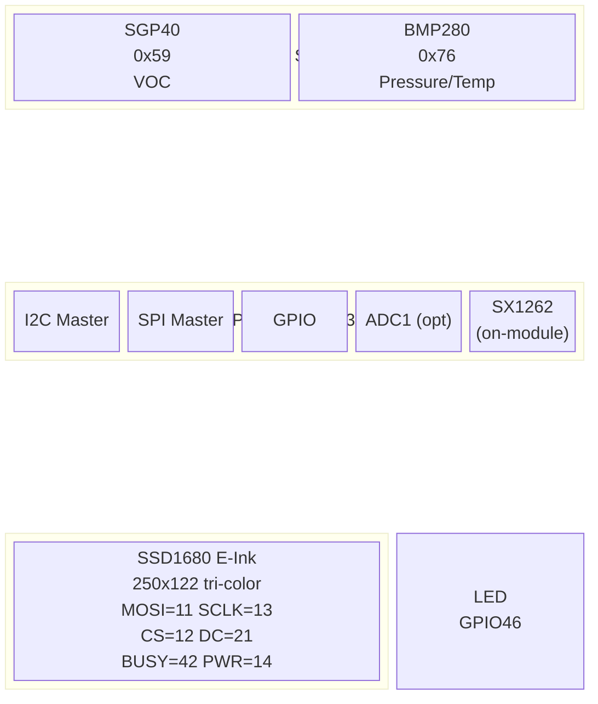
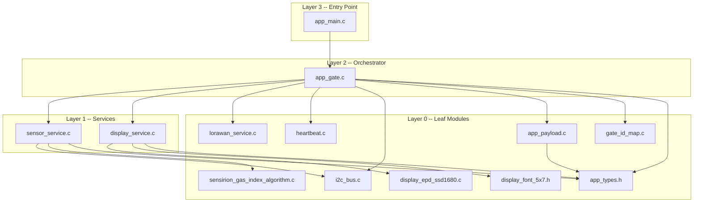
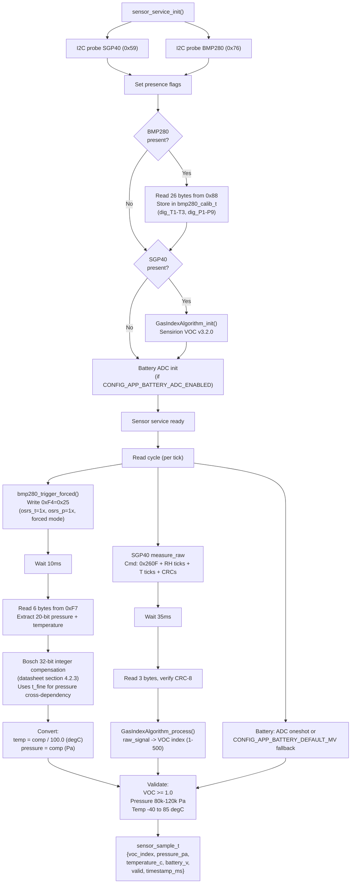
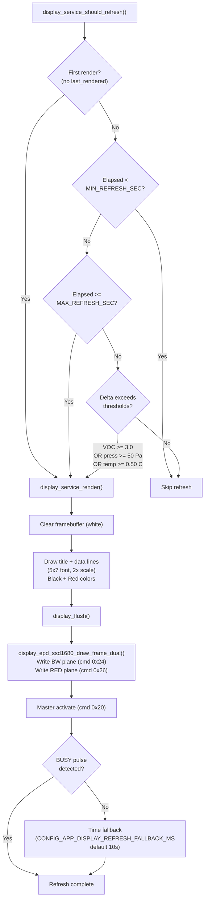
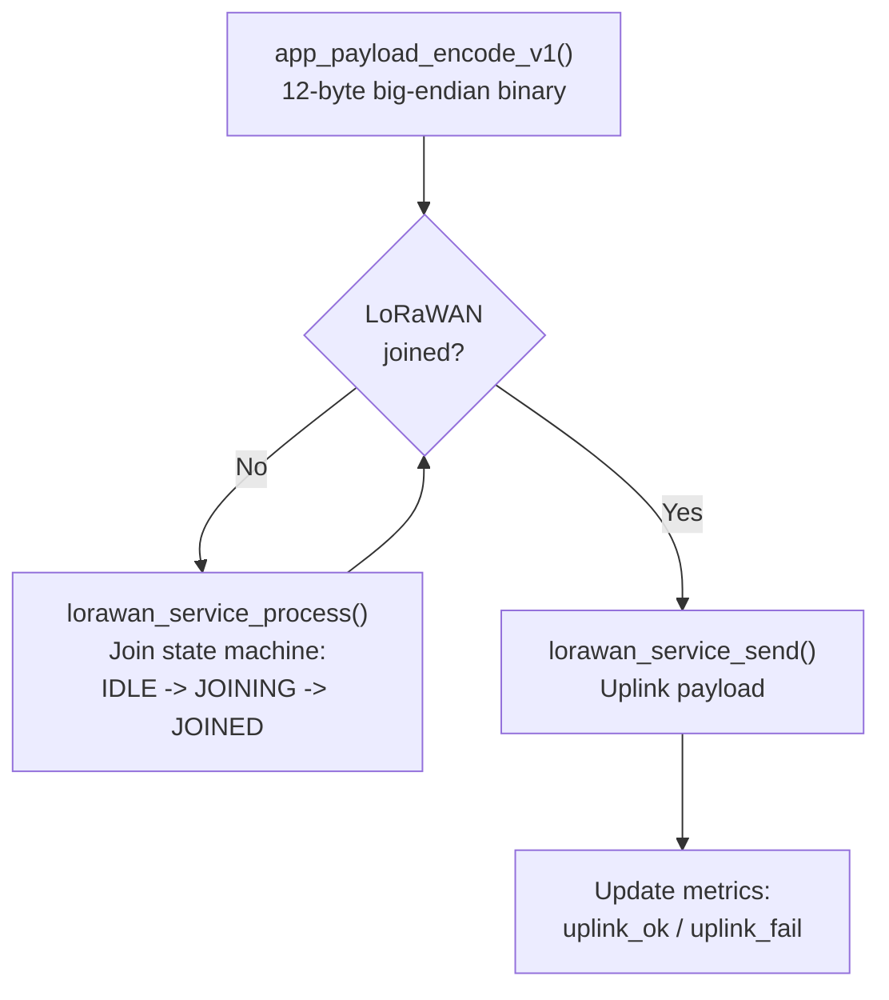

# System Architecture

Comprehensive architecture reference for the RAK4630 E-Ink environmental monitoring node.
Reflects the codebase as-built after code review rounds #1--#7.

---

## 1. System Overview

| Attribute | Value |
|-----------|-------|
| Purpose | WisBlock environmental node -- VOC + pressure/temperature monitoring with E-Ink display and LoRaWAN uplink |
| MCU module | RAK3312 (ESP32-S3 + SX1262 on-module) |
| Baseboard | RAK19007 WisBlock Base |
| Display | RAK14000 E-Ink (SSD1680 tri-color, 250x122 landscape) |
| Sensors | SGP40 (VOC, I2C 0x59) + BMP280 (pressure/temperature, I2C 0x76) |
| Network | LoRaWAN OTAA, AS923-1 (Bangladesh), ChirpStack v4 |
| Framework | ESP-IDF v5.5 |
| Execution model | Gate-driven: one subsystem validated per flash cycle |

---

## 2. Hardware Block Diagram



**Pin mapping summary:**

| Function | GPIO | Bus |
|----------|------|-----|
| I2C SDA | 9 | I2C0 |
| I2C SCL | 40 | I2C0 |
| Display MOSI | 11 | SPI2 |
| Display SCLK | 13 | SPI2 |
| Display CS | 12 | SPI2 |
| Display DC | 21 | GPIO |
| Display BUSY | 42 | GPIO (input) |
| Display PWR | 14 | GPIO (input-pullup) |
| Heartbeat LED | 46 | GPIO (output) |
| SX1262 | On-module | SPI (internal) |

---

## 3. Software Architecture

### 3a. Module Dependency Graph



### 3b. Module Descriptions

| Module | File | Role | Key Exports | Dependencies |
|--------|------|------|-------------|--------------|
| **app_main** | `app_main.c` | Entry point; NVS init, gate context creation, tick loop | `app_main()` | app_gate |
| **app_gate** | `app_gate.c` | Gate state machine, tick dispatch, pass/fail/halt logic | `app_gate_init()`, `app_gate_tick()`, `app_gate_name()`, `app_gate_is_halted()` | All services, gate_id_map, app_payload, app_types |
| **gate_id_map** | `gate_id_map.c` | Legacy-to-canonical gate ID translation (pure function) | `app_gate_translate_legacy_id()` | None |
| **app_payload** | `app_payload.c` | Payload v1 binary encode (12 bytes big-endian) + hex formatter | `app_payload_encode_v1()`, `app_payload_hex()` | app_types |
| **app_types** | `app_types.h` | Shared `sensor_sample_t` struct | `sensor_sample_t` | None |
| **heartbeat** | `heartbeat.c` | FreeRTOS task toggling LED GPIO at 1 Hz (500ms period) | `heartbeat_start()`, `heartbeat_get_toggle_count()`, `heartbeat_is_running()` | FreeRTOS, GPIO driver |
| **i2c_bus** | `i2c_bus.c` | I2C master init, scan (0x03--0x77), probe, read/write primitives | `i2c_bus_init()`, `i2c_bus_probe()`, `i2c_bus_scan()`, `i2c_bus_write()`, `i2c_bus_read()`, `i2c_bus_write_read()` | ESP-IDF I2C driver |
| **sensor_service** | `sensor_service.c` | SGP40/BMP280 identity check, calibration, sample pipeline, battery ADC | `sensor_service_init()`, `sensor_service_read()`, `sensor_service_read_voc_only()`, `sensor_service_read_bmp280()`, `sensor_service_read_battery_v()` | i2c_bus, sensirion_gas_index_algorithm |
| **display_service** | `display_service.c` | Threshold-based refresh policy, framebuffer management, text rendering | `display_service_init()`, `display_service_render()`, `display_service_should_refresh()`, `display_service_render_hello_world()` | display_epd_ssd1680, display_font_5x7 |
| **display_epd_ssd1680** | `display_epd_ssd1680.c` | Low-level SPI transport for SSD1680 (cmd/data, busy-wait, power control) | `display_epd_ssd1680_init()`, `display_epd_ssd1680_draw_frame_dual()`, `display_epd_ssd1680_get_diag()` | ESP-IDF SPI + GPIO drivers |
| **display_font_5x7** | `display_font_5x7.h` | Header-only bitmap font (uppercase A-Z, 0-9, punctuation) | `display_font_5x7_get()` | None |
| **lorawan_service** | `lorawan_service.c` | Join state machine, uplink send, metrics tracking (currently stub-based) | `lorawan_service_init()`, `lorawan_service_process()`, `lorawan_service_is_joined()`, `lorawan_service_send()`, `lorawan_service_get_metrics()` | None (stub) |
| **sensirion_gas_index_algorithm** | `sensirion_gas_index_algorithm.c` | Sensirion VOC Gas Index Algorithm v3.2.0 (vendored) | `GasIndexAlgorithm_init()`, `GasIndexAlgorithm_process()` | None |

---

## 4. Gate-Driven Execution Model

### 4a. Gate Progression

```mermaid
graph LR
    G0["Gate 0\nenv"] --> G1["Gate 1\nheartbeat"]
    G1 --> G2["Gate 2\ndisplay_smoke"]
    G2 --> G2P1["Gate 2.1\ni2c_smoke"]
    G2P1 --> G3["Gate 3\ni2c_presence"]
    G3 --> G4["Gate 4\nsensor_pipeline"]
    G4 --> G5["Gate 5\npayload_v1"]
    G5 --> G6["Gate 6\nlorawan_join_uplink"]
    G6 --> G7["Gate 7\nreliability_buffer"]
    G7 --> G8["Gate 8\nfuota_scaffold"]
    G8 --> G9["Gate 9\nlive_publish"]
```



### 4b. Gate Table

| Gate | ID | Name | Validates | Services Initialized | Pass Criteria |
|------|----|------|-----------|---------------------|---------------|
| 0 | 0 | `env` | Toolchain sanity | None | Instant -- logs IDF version, build date |
| 1 | 1 | `heartbeat` | LED toggle on GPIO 46 | heartbeat | Running 3s with >= 6 toggles |
| 2 | 2 | `display_smoke` | SPI bus + SSD1680 hello-world render | display_service | SPI bus check OK + hello world render (tri-color cycle) |
| 2.1 | 21 | `i2c_smoke` | I2C bus scan + device probe | i2c_bus | Expected devices respond to probe (configurable via `CONFIG_APP_GATE2P1_EXPECTED_DEVICES`) |
| 3 | 3 | `i2c_presence` | SGP40/BMP280 address presence | i2c_bus | Expected devices respond to probe (configurable via `CONFIG_APP_GATE3_EXPECTED_DEVICES`) |
| 4 | 4 | `sensor_pipeline` | Sensor identity + sample read + plausibility | i2c_bus, sensor_service | Identity OK + 3 consecutive valid reads within range |
| 5 | 5 | `payload_v1` | Payload encode against known test vector | None | Encoded output matches expected 12-byte vector |
| 6 | 6 | `lorawan_join_uplink` | OTAA join + first uplink | lorawan_service | Joined + >= 1 uplink OK |
| 7 | 7 | `reliability_buffer` | Store-and-forward buffer flush after join | lorawan_service | Joined + >= 1 buffer flushed |
| 8 | 8 | `fuota_scaffold` | FUOTA hook readiness (placeholder) | None | Instant -- logs manifest/hooks/rollback |
| 9 | 9 | `live_publish` | Full cycle: sensor read -> display render -> uplink | i2c_bus, sensor_service, display_service, lorawan_service | >= 2 sensor reads + >= 1 display update + >= 1 uplink OK |

### 4c. Gate Execution Policy

1. **One gate per flash cycle.** `CONFIG_APP_GATE` selects the active gate at compile time.
2. **Tick-driven.** `app_main()` calls `app_gate_tick()` every `CONFIG_APP_GATE_TICK_MS` (default 200ms).
3. **On PASS:** the firmware halts and logs `result=PASS gate=<id>`. A periodic idle log repeats every `CONFIG_APP_GATE_IDLE_LOG_SEC` seconds.
4. **To advance:** change `CONFIG_APP_GATE` in sdkconfig and reflash.
5. **Legacy ID scheme:** when `CONFIG_APP_GATE_ID_SCHEME_LEGACY` is enabled, legacy gate IDs 0--8 are translated to canonical IDs via `gate_id_map.c`:

| Legacy ID | Canonical ID | Gate Name |
|-----------|-------------|-----------|
| 0 | 0 | env |
| 1 | 1 | heartbeat |
| 2 | 3 | i2c_presence |
| 3 | 4 | sensor_pipeline |
| 4 | 5 | payload_v1 |
| 5 | 6 | lorawan_join_uplink |
| 6 | 7 | reliability_buffer |
| 7 | 8 | fuota_scaffold |
| 8 | 9 | live_publish |

### 4d. Conditional Service Initialization

`app_gate_init()` initializes only the services required by the selected gate:

```
Gate requires I2C:           2.1, 3, 4, 9
Gate requires sensor_init:   4, 9
Gate requires display_init:  2, 9
Gate requires lorawan_init:  6, 7, 9
Gate requires heartbeat:     1
```

For gates 4 and 9, the expected device mask (`CONFIG_APP_GATE4_EXPECTED_DEVICES` / `CONFIG_APP_GATE9_EXPECTED_DEVICES`) determines which sensors must be present at init time. Missing required sensors cause `ESP_ERR_NOT_FOUND`.

---

## 5. Data Flow

### 5a. Sensor Pipeline



**Key implementation details:**

- BMP280 operates in **forced mode** -- each read triggers a single measurement, then the sensor returns to sleep. This avoids continuous power draw.
- BMP280 compensation uses **Bosch 32-bit integer formulas** (not floating-point). Temperature is computed first to produce `t_fine`, which is then used for pressure compensation.
- SGP40 commands include **Sensirion CRC-8** (poly 0x31, init 0xFF) on both TX parameters and RX data. Failed CRCs retry up to 3 times.
- VOC raw signal is processed through **Sensirion Gas Index Algorithm v3.2.0** which maintains internal state for adaptive baseline correction.
- Battery voltage: either ADC1 oneshot (with configurable divider ratio) or a compile-time default (`CONFIG_APP_BATTERY_DEFAULT_MV`, default 3950mV).

### 5b. Display Pipeline



**Key implementation details:**

- **Threshold-based refresh policy** with three configurable deltas:
  - VOC: `CONFIG_APP_REFRESH_VOC_DELTA_X100` / 100 (default 3.0 index units)
  - Pressure: `CONFIG_APP_REFRESH_PRESSURE_DELTA_PA` (default 50 Pa)
  - Temperature: `CONFIG_APP_REFRESH_TEMP_DELTA_CENTI_C` / 100 (default 0.50 C)
- **Min refresh spacing:** `CONFIG_APP_DISPLAY_MIN_REFRESH_SEC` (default 30s)
- **Max refresh interval:** `CONFIG_APP_DISPLAY_MAX_REFRESH_SEC` (default 1800s) -- forces refresh to prevent E-Ink ghosting
- **Tri-color framebuffer:** separate BW and RED planes. Pixel encoding:
  - White: BW=1, RED=0
  - Black: BW=0, RED=0
  - Red: BW=1, RED=1
- **BUSY detection:** monitors pin with configurable polarity. If no BUSY pulse is seen, falls back to a conservative time delay.
- **Power pin:** WB_IO2 (GPIO14) configured as input with pull-up (RAK14000 style) by default.

### 5c. Uplink Pipeline



**LoRaWAN join state machine** (currently stub-based):

```
IDLE --[backend_active]--> JOINING --[delay elapsed]--> JOINED
IDLE --[!backend_active]--> IDLE (retry after backoff)
JOINING --[!backend_active]--> IDLE (abort, retry)
```

- Join backoff: `CONFIG_APP_LORAWAN_JOIN_BACKOFF_MS` (default 5000ms)
- Simulated join delay: `CONFIG_APP_LORAWAN_JOIN_SUCCESS_DELAY_MS` (default 4000ms)
- Metrics tracked: `join_attempts`, `join_successes`, `join_failures`, `retries`, `uplink_ok`, `uplink_fail`

---

## 6. Configuration Model

All configuration is Kconfig-driven via `firmware/main/Kconfig.projbuild` under the menu **"RAK4630 E-Ink Node"**.

### Configuration Groups

| Group | Key Configs | Defaults |
|-------|-------------|----------|
| **Gate Selection** | `APP_GATE`, `APP_GATE_ID_SCHEME`, `APP_GATE_LEGACY` | Gate 1, new scheme |
| **Gate Timing** | `APP_GATE_TICK_MS`, `APP_GATE_IDLE_LOG_SEC`, `APP_GATE_SAMPLE_PERIOD_MS`, `APP_GATE_UPLINK_PERIOD_MS` | 200ms tick, 10s idle log, 1000ms sample/uplink |
| **Gate Device Expectations** | `APP_GATE2P1_EXPECTED_DEVICES`, `APP_GATE3_EXPECTED_DEVICES`, `APP_GATE4_EXPECTED_DEVICES`, `APP_GATE9_EXPECTED_DEVICES` | 3 (both sensors) |
| **I2C** | `APP_I2C_PORT`, `APP_I2C_SDA_GPIO`, `APP_I2C_SCL_GPIO`, `APP_I2C_FREQ_HZ` | Port 0, SDA=9, SCL=40, 100kHz |
| **I2C Addresses** | `APP_SGP40_ADDR`, `APP_BMP280_ADDR` | 0x59, 0x76 |
| **Display SPI** | `APP_DISPLAY_SPI_HOST`, `APP_DISPLAY_SPI_MHZ`, `APP_DISPLAY_PIN_*` | SPI2, 4MHz, MOSI=11, SCLK=13, CS=12, DC=21, RST=-1, BUSY=42, PWR=14 |
| **Display Panel** | `APP_DISPLAY_PANEL_PROFILE`, `APP_DISPLAY_LANDSCAPE`, `APP_DISPLAY_XRAM_OFFSET` | SSD1680 250x122, landscape, offset=0 |
| **Display Behavior** | `APP_DISPLAY_BUSY_ACTIVE_HIGH`, `APP_DISPLAY_PWR_ACTIVE_HIGH`, `APP_DISPLAY_PWR_INPUT_PULLUP`, `APP_DISPLAY_PARTIAL_UPDATES`, `APP_DISPLAY_REQUIRE_BUSY_PULSE`, `APP_DISPLAY_REFRESH_FALLBACK_MS` | Active-low BUSY, active-high PWR, input-pullup, no partial, no BUSY requirement, 10s fallback |
| **Refresh Thresholds** | `APP_DISPLAY_MIN_REFRESH_SEC`, `APP_DISPLAY_MAX_REFRESH_SEC`, `APP_REFRESH_VOC_DELTA_X100`, `APP_REFRESH_PRESSURE_DELTA_PA`, `APP_REFRESH_TEMP_DELTA_CENTI_C` | 30s min, 1800s max, VOC 3.0, pressure 50Pa, temp 0.50C |
| **Production Cadence** | `APP_SAMPLE_PERIOD_SEC`, `APP_UPLINK_PERIOD_SEC` | 300s each |
| **Battery** | `APP_BATTERY_ADC_ENABLED`, `APP_BATTERY_ADC_CHANNEL`, `APP_BATTERY_DIVIDER_X100`, `APP_BATTERY_DEFAULT_MV` | Disabled, ch3, 2.0x divider, 3950mV default |
| **LoRaWAN** | `APP_LORAWAN_BACKEND_ACTIVE`, `APP_LORAWAN_JOIN_BACKOFF_MS`, `APP_LORAWAN_JOIN_SUCCESS_DELAY_MS` | Active, 5000ms backoff, 4000ms join delay |

### Configuration Files

| File | Purpose |
|------|---------|
| `firmware/main/Kconfig.projbuild` | Kconfig definitions and defaults |
| `firmware/sdkconfig.defaults` | Production default overrides |
| `firmware/.env` | OTAA credentials (DEVEUI, APPKEY) -- gitignored |
| `firmware/.env.example` | Template for credentials file |

---

## 7. Build and Test

### 7a. Build

```bash
source $IDF_PATH/export.sh
idf.py -C firmware build
idf.py -C firmware -p /dev/cu.usbmodem1101 flash monitor
```

Interactive configuration:

```bash
idf.py -C firmware menuconfig    # menu: "RAK4630 E-Ink Node"
```

### 7b. Host Tests

```bash
tests/host/run_tests.sh
```

Compiles firmware C modules with the **system C compiler** (no ESP-IDF or hardware needed):

| Test | Source | Module Under Test | What It Verifies |
|------|--------|-------------------|------------------|
| `payload_encode_test` | `tests/host/payload_encode_test.c` | `app_payload.c` | Deterministic 12-byte vector for `app_payload_encode_v1()` |
| `gate_id_map_test` | `tests/host/gate_id_map_test.c` | `gate_id_map.c` | Legacy-to-canonical ID translation for all 9 mappings + invalid input |

Tests compile with `-Wall -Wextra -Werror` and print `PASS` on success or return nonzero on failure.

### 7c. Gate Execution

Helper scripts in `examples/gates/`:

| Script | Purpose |
|--------|---------|
| `set_gate_new.sh <id>` | Set canonical gate in sdkconfig (accepts `2.1` for i2c_smoke) |
| `set_gate_legacy.sh <id>` | Set legacy gate |
| `run_gate.sh <id>` | Set + build + flash + monitor in one step |
| `run_gate_1_heartbeat.sh` | Per-gate convenience script |
| `run_gate_2_display.sh` | Per-gate convenience script |
| `run_gate_2_1_i2c.sh` | Per-gate convenience script |
| `run_gate_3_i2c_presence.sh` | Per-gate convenience script |
| `run_gate_4_sensor_pipeline.sh` | Per-gate convenience script |
| `run_gate_6_lorawan_join_uplink.sh` | Per-gate convenience script |
| `run_gate_7_reliability_buffer.sh` | Per-gate convenience script |
| `run_gate_8_fuota_scaffold.sh` | Per-gate convenience script |
| `run_gate_9_live_publish.sh` | Per-gate convenience script |

---

## 8. Payload Schema (v1)

12-byte big-endian binary format:

| Offset | Field | Type | Encoding | Example (for VOC=100.0, P=100900Pa, T=29.0C, Batt=4.0V) |
|--------|-------|------|----------|-------|
| 0 | Schema version | uint8 | Literal `0x01` | `01` |
| 1--2 | VOC index | uint16 BE | value x 100 | `27 10` (10000 = 100.00) |
| 3--6 | Pressure | uint32 BE | Pa (integer) | `00 01 8A 24` (100900) |
| 7--8 | Temperature | int16 BE | value x 100 (centi-C) | `0B 54` (2900 = 29.00C) |
| 9--10 | Battery | uint16 BE | millivolts | `0F A0` (4000 = 4.000V) |
| 11 | Status flags | uint8 | bit 0 = valid | `01` |

**Test vector:** `01 27 10 00 01 8A 24 0B 54 0F A0 01`

Encoding is performed by `app_payload_encode_v1()`. Values are clamped to uint16 range where applicable. The hex formatter `app_payload_hex()` produces space-separated uppercase hex for logging.

---

## 9. FUOTA (Emergency-Only)

FUOTA (Firmware Update Over The Air) is designed as an **emergency-only** recovery mechanism:

| Attribute | Value |
|-----------|-------|
| Trigger | Emergency recovery only (not routine updates) |
| Rollback policy | **Hard required** -- every update must support automatic rollback |
| Max downtime | 30 minutes |
| Gate validation | Gate 8 (`fuota_scaffold`) verifies hook readiness |
| Current status | **Placeholder** -- multicast, fragment, and rollback hooks are logged but not implemented |

Gate 8 currently logs readiness markers and passes immediately:
- `multicast_hook=ready`
- `fragment_hook=ready`
- `rollback_policy=hard_required`
- `version_payload=01 00 00 00`
- `downgrade_block=1`

---

## 10. Engineering Principles

These principles govern the bring-up and validation process:

1. **Incremental and reversible** -- one gate at a time, each validating a single subsystem
2. **Independent validation** -- each subsystem is tested in isolation before integration
3. **Single variable changes** -- never modify multiple hardware variables in one step
4. **Evidence capture** -- record exact wiring, slot placement, and firmware commit hash for every test run
5. **Credentials isolation** -- production keys stay in `firmware/.env` (gitignored), never in source
6. **Gate completion criteria** -- build succeeds from clean, serial monitor shows `result=PASS`, test evidence captured in `docs/`
